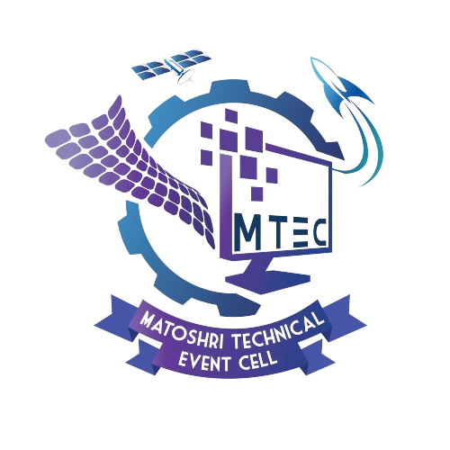

<a href="https://mtec.vercel.app/">
<p align="center">

</p>
</a>
<h1 align="center">MTEC - Matoshri Technical Event Cell</h1>
<br>

The Matoshri Technical Event Cell (TEC) is a student-driven organization committed to enhancing the educational experience by integrating practical applications of theoretical knowledge in technology fields. 

## Mission

Fostering innovation and hands-on learning through diverse activities including hackathons, coding competitions, and robotics workshops. These initiatives encourage students to creatively apply their technical skills, solving real-world challenges and pushing the boundaries of traditional learning.

## Institute

Matoshri Education Society's,
**Matoshri College of Engineering and Research Centre**, Eklahare, Nashik, Maharashtra, India.

## Contact

- [Website](https://mtec.vercel.app/)
- [Matoshri College of Engineering and Research Centre, Eklahare, Nashik](https://engg.matoshri.edu.in/)
- [LinkedIn](https://www.linkedin.com/company/tech-mtec/)
- [Twitter](https://twitter.com/tech_mcoerc)
- [Instagram](https://www.instagram.com/tech.mcoerc/)

---
<details>
    <summary><h2> For development purpose</h2></summary>

This is a [Next.js](https://nextjs.org/) project bootstrapped with [`create-next-app`](https://github.com/vercel/next.js/tree/canary/packages/create-next-app).

### Getting Started

First, run the development server:

```bash
npm run dev
# or
yarn dev
# or
pnpm dev
# or
bun dev
```

Open [http://localhost:3000](http://localhost:3000) with your browser to see the result.

You can start editing the page by modifying `app/page.js`. The page auto-updates as you edit the file.

This project uses [`next/font`](https://nextjs.org/docs/basic-features/font-optimization) to automatically optimize and load Inter, a custom Google Font.

### Learn More

To learn more about Next.js, take a look at the following resources:

- [Next.js Documentation](https://nextjs.org/docs) - learn about Next.js features and API.
- [Learn Next.js](https://nextjs.org/learn) - an interactive Next.js tutorial.

You can check out [the Next.js GitHub repository](https://github.com/vercel/next.js/) - your feedback and contributions are welcome!

### Deploy on Vercel

The easiest way to deploy your Next.js app is to use the [Vercel Platform](https://vercel.com/new?utm_medium=default-template&filter=next.js&utm_source=create-next-app&utm_campaign=create-next-app-readme) from the creators of Next.js.

Check out our [Next.js deployment documentation](https://nextjs.org/docs/deployment) for more details.

</details>

### Contributors

<a href="https://github.com/ajaymendade/mtec/graphs/contributors">
  
</a>
